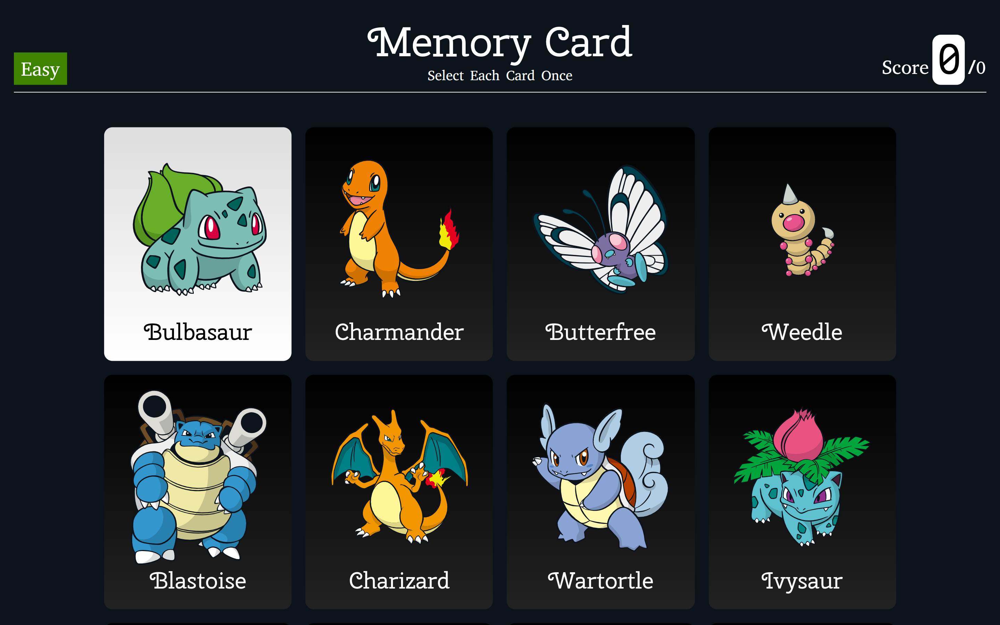
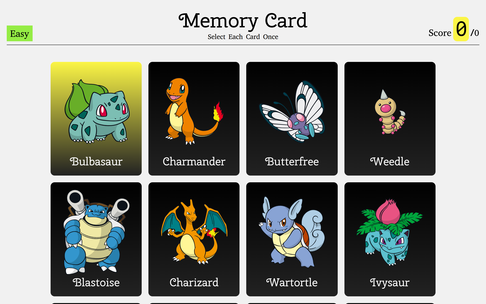

# Memory Card

### Select unique cards as they are _shuffled_.

### [Play!](https://memoory-card.netlify.app/)

## Preview

Graphical user interface for dark and light mode.

## Skills

- Connecting to API with useEffect react hook.

- Displaying fetched API data in react components.

- Animate components by orchestrating component state and events.

- Reset component state by passing different value to key prop.

## Credits

Project from _TOP (The Odin Project)_ curriculum

Card Images and Text from _PokeAPI_
